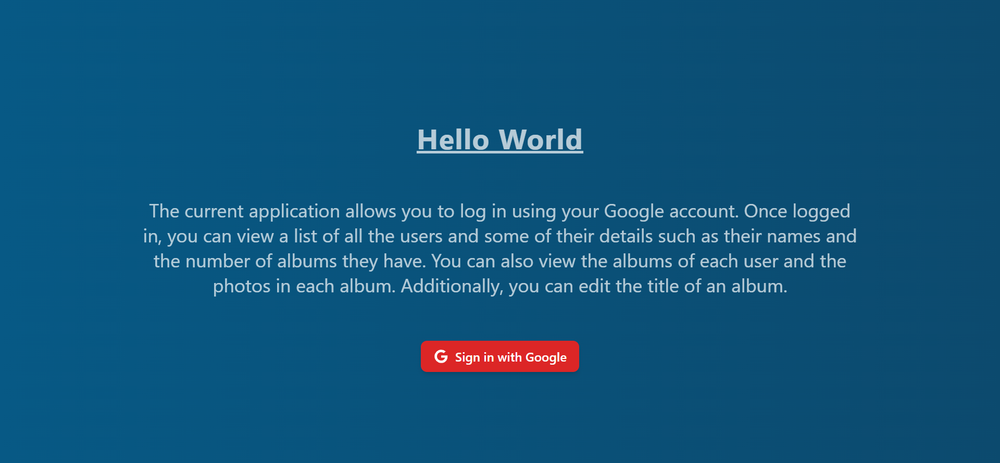
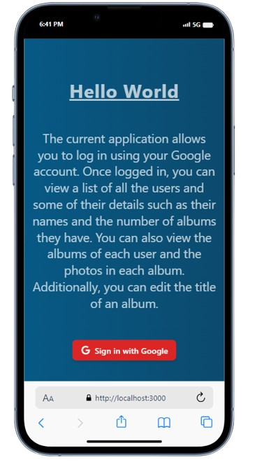

# Project Name: SIL ASSESSMENT

> The current application allows you to log in using your Google account. Once logged in, you can view a list of all the users and some of their details such as their names and the number of albums they have. You can also view the albums of each user and the photos in each album. Additionally, you can edit the title of an album.

## Built With

- Major languages: JavaScript
- Library/Framework: Reactjs | Nodejs | Expressjs
- API: https://jsonplaceholder.typicode.com/

## Live Demo

[Live Demo Link](https://sil-assessment-frontend.vercel.app/)

## Preview





## Getting started

#### Clone this repository

```bash
$ git clone https://github.com/trace-kadenyi/sil-assessment-frontend.git
```

#### Clone the backend

```bash
$ https://github.com/trace-kadenyi/SIL-Assessment-Backend.git
```

#### open two separate terminals and cd into directories

```
$ cd <relative-path>/sil-assessment-frontend/
$ cd <relative-path>/SIL-Assessment-Backend/
```

#### install dependencies by running the following command on the two terminals

```run
$ npm i
```

#### run project the frontend project

```
$ npm start
```

#### run project the backend project

```
$ npm run dev
```

#### environment variable

- For security purposes, I created a .env file that contains the values found in the firebaseconfig.js file.
- Therefore, to successfully run my project locally, you will need to create your own.
- Follow <a href="https://firebase.google.com/docs/auth/web/google-signin">THIS LINK</a> on how to set up your own firebase configuration

## Authors

👤 **Tracey Kadenyi**

- GitHub: [trace-kadenyi](https://github.com/trace-kadenyi)
- LinkedIn: [Tracey Kadenyi](https://www.linkedin.com/in/tracey-kadenyi/)

👤

## 🤝 Contributing

Contributions, issues, and feature requests are welcome!

Feel free to check the [issues page](../../issues/).

## Show your support

Give a ⭐️ if you like this project!
